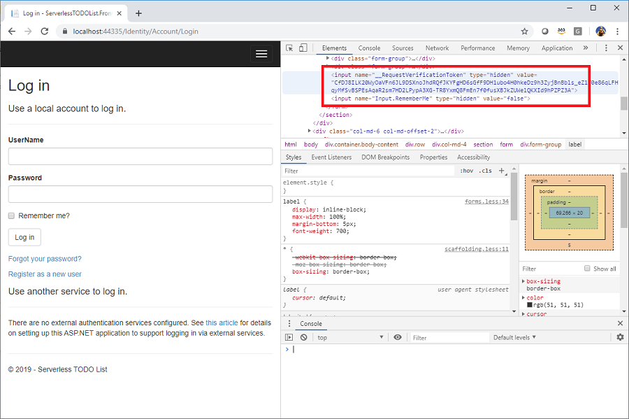
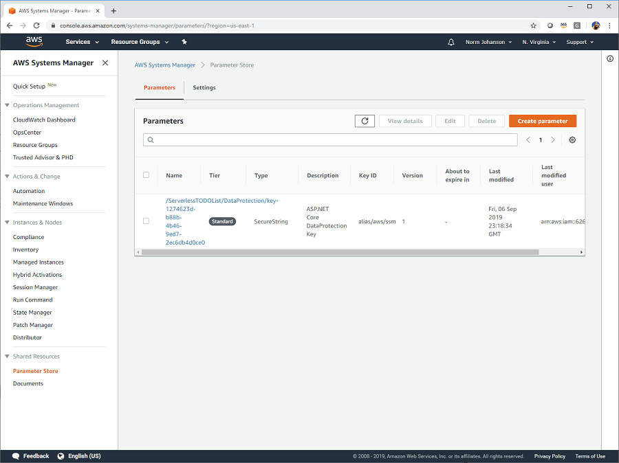

# Persisting ASP.NET Core Data Protection Keys

ASP.NET Core forms use antiforgery tokens to protect your site. In our application if we inspect the login form you can see the hidden **__RequestVerificationToken** form field
with a long cryptographic string. When this form is submitted the antiforgery token is verified to ensure the request is valid.

ASP.NET Core's data protection framework is used to create the antiforgery tokens using encryption keys generated at runtime.



## Keys for development

By default data protection will store generated encryption keys either in memory or the local file system. For local development this works fine.
For a production deployment this is not a valid solution for storing keys. For example if you have more then one webserver they would each be using different encryption keys. If one webserver serves 
the request but a different server handles the form POST then it will fail the antiforgery verification. 

## Sharing keys in production

In a production environment we need a way to share the data protection keys across all of the webservers handling our application. We can do this quite easily using
the **Amazon.AspNetCore.DataProtection.SSM** NuGet package. This package will use AWS System Manager to store and retrieve data protection keys from Parameter Store.


## Setting up Amazon.AspNetCore.DataProtection.SSM

The first thing we need to do is add the <a href="https://www.nuget.org/packages/Amazon.AspNetCore.DataProtection.SSM/" target="_blank">Amazon.AspNetCore.DataProtection.SSM</a> NuGet package to our ASP.NET Core application.

```
~/ServerlessTODOList.Frontend> dotnet add package Amazon.AspNetCore.DataProtection.SSM
```

Once the package is added we need to add the code to enable it. This is done in the Startup's `ConfigureServices` method by calling `PersistKeysToAWSSystemsManager`.
The parameter passed into `PersistKeysToAWSSystemsManager` will be the parameter name prefix for the keys stored in Parameter Store.

```csharp
// This method gets called by the runtime. Use this method to add services to the container.
public void ConfigureServices(IServiceCollection services)
{
    services.Configure<CookiePolicyOptions>(options =>
    {
        // This lambda determines whether user consent for non-essential cookies is needed for a given request.
        options.CheckConsentNeeded = context => true;
        options.MinimumSameSitePolicy = SameSiteMode.None;
    });

    services.AddMvc().SetCompatibilityVersion(CompatibilityVersion.Version_2_1);

    // AddAWSService is provided by the AWSSDK.Extensions.NETCore.Setup NuGet package.
    services.AddAWSService<Amazon.DynamoDBv2.IAmazonDynamoDB>();
    services.AddSingleton(typeof(ITODOListDataAccess), typeof(TODOListDataAccess));

    // Register Cognito Identity services.
    services.AddCognitoIdentity();

    // Register AWS System Manager's parameter store as the persistence for data protection keys.
    services.AddDataProtection()
        .PersistKeysToAWSSystemsManager("/ServerlessTODOList/DataProtection");
}
```

## Test

Now when you run the application you can see in Parameter Store the data protection key stored as a secure string. All 
the webservers supporting our application will share their keys through parameter store.



<!-- Generated Navigation -->
---

* [Getting Started](../GettingStarted.md)
* [What is a serverless application?](../WhatIsServerless.md)
* [Common AWS Serverless Services](../CommonServerlessServices.md)
* [What are we going to build in this tutorial](../WhatAreWeBuilding.md)
* [TODO List AWS Services Used](../TODOListServices.md)
* [Using DynamoDB to store TODO Lists](../DynamoDBModule/WhatIsDynamoDB.md)
* [Handling service events with Lambda](../StreamProcessing/ServiceEvents.md)
* [Getting ASP.NET Core ready for Serverless](../ASP.NETCoreFrontend/TheFrontend.md)
  * [Dependency Injection](../ASP.NETCoreFrontend/DependencyInjection.md)
  * [Using Amazon Cognito for Identity](../ASP.NETCoreFrontend/WebIdentity.md)
  * **Persisting ASP.NET Core Data Protection Keys**
  * [AWS Systems Manager Parameter Store for Managing Configuration](../ASP.NETCoreFrontend/ParameterStoreConfigurationProvider.md)
  * [ASP.NET Core wrap up](../ASP.NETCoreFrontend/FrontendWrapup.md)
* [Deploying ASP.NET Core as a Serverless Application](../DeployingFrontend/DeployingFrontend.md)
* [Tear Down](../TearDown.md)
* [Final Wrap Up](../FinalWrapup.md)

Continue on to next page: [AWS Systems Manager Parameter Store for Managing Configuration](../ASP.NETCoreFrontend/ParameterStoreConfigurationProvider.md)

