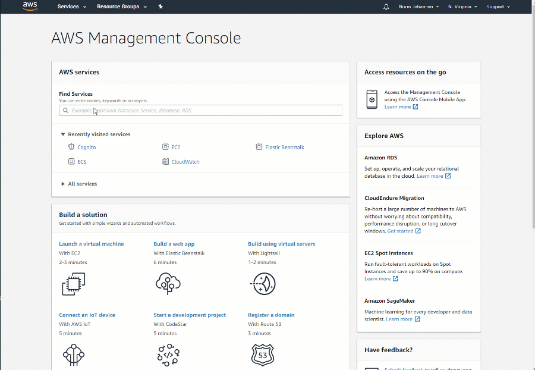
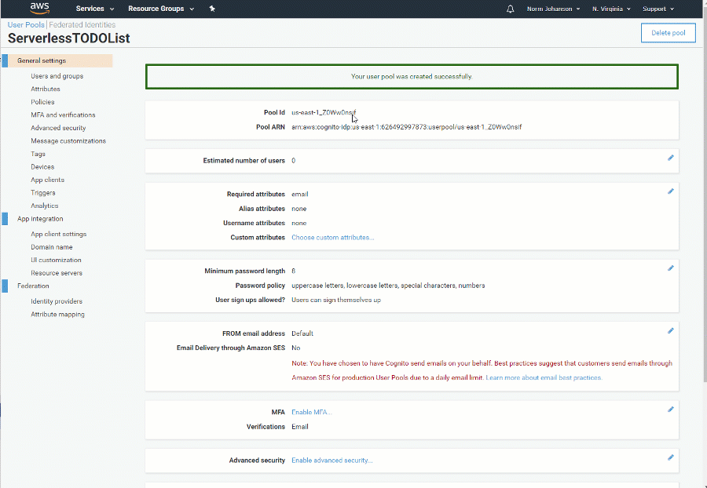

# Using Amazon Cognito for Identity

Currently the application is using the default SQL Server Entity Framework based provider to handle identity. This requires us to manage a SQL Server instance
when we deploy. Since we want to take advantage of serverless technologies and not have to maintain a SQL Server instance we need another option. 

<a href-="https://docs.aws.amazon.com/cognito/latest/developerguide/what-is-amazon-cognito.html" target="_blank">Amazon Cognito</a> handles identity without requiring 
any infrastructure. We just need to create a user pool within Cognito and configure our ASP.NET Core application to use it.

Here we are going to do a brief setup to configure our application to use Cognito. For further information check out the <a href="https://github.com/aws/aws-aspnet-cognito-identity-provider" target="_blank">ASP.NET Core Identity Provider for Amazon Cognito</a> repository.


## Add config settings

Before we create our user pool lets add the empty user pool configuration fields to the **appsettings.Development.json** file. To do this:

* Open the **appsettings.Development.json** file.
* In the AWS section add the **UserPoolId, UserPoolClientId and UserPoolClientSecret** fields.
* Be sure to leave Region and Profile fields set to the values previously set in the tutorial.

We will set the values for these fields as we create the user pool. 

```json
{
  "ConnectionStrings": {
    "DefaultConnection": "Server=(localdb)\\mssqllocaldb;Database=aspnet-ServerlessTODOList-53bc9b9d-9d6a-45d4-8429-2a2761773502;Trusted_Connection=True;MultipleActiveResultSets=true"
  },
  "Logging": {
    "LogLevel": {
      "Default": "Debug",
      "System": "Information",
      "Microsoft": "Information"
    }
  },
  "AWS": {
    "Region": "",
    "Profile": "",
    "UserPoolId": "",
    "UserPoolClientId": "",
    "UserPoolClientSecret": ""
  }
}
```


## Creating a User Pool

Cognito User pools have a lot of features that you can use to customize the login process. For this tutorial we are going to use the Cognito web console to create the user 
pool using the default settings. Use the following steps to create the user pool and update the application's configuration.



* Login to the [Cognito web console](https://console.aws.amazon.com/cognito/home)
* Ensure region is set to the correct region
* In **Find Services** text box enter **Cognito** and press enter
* Click Manage User Pools
* Click Create a User Pool
* Enter a pool name. For example ServerlessTODOList
* Click Review defaults
* Click Create pool
* In the **appsettings.Development.json** file set the **UserPoolId** to the **Pool Id** displayed.

Now that the user pool is created we need to create an app client for the pool. A user pool can have multiple app clients for example a mobile client, desktop client 
and web application client. For each client a client id and a client secret is generated which the clients will use to access the user pool for user registration and login.

Lets create a client for our web application.



* Click on **App clients** under **General Settings**
* Click **Add an app client**
* Enter a **App client name**. For example WebApp
* Click **Create app client**
* Click **Show Details**
* In the **appsettings.Development.json** file set the **UserPoolClientId** to the **App client id** displayed and **UserPoolClientSecret** to the **App client secret** displayed.

## Add ASP.NET Core Cognito Identity Provider

Cognito has its own API to register and login users and ASP.NET Core also has its own framework for handling user registration and login. The 
**Amazon.AspNetCore.Identity.Cognito** NuGet package bridges Cognito API and ASP.NET Core framework so they can work seamlessly together.

To get started add the **Amazon.AspNetCore.Identity.Cognito** NuGet package to the **ServerlessTODOList.Frontend** project.
```
~/ServerlessTODOList.Frontend> dotnet add package Amazon.AspNetCore.Identity.Cognito
```

### Edit Startup.cs

In the `ConfigureServices` method in Startup.cs is the default code to register SQL Server as the identity provider.

```csharp
// Default SQL Server Entity Framework Identity setup
services.AddDbContext<ApplicationDbContext>(options =>
    options.UseSqlServer(
        Configuration.GetConnectionString("DefaultConnection")));
services.AddDefaultIdentity<IdentityUser>()
    .AddEntityFrameworkStores<ApplicationDbContext>();
```

To use Cognito instead replace the above code with the following line that injects the Cognitio implementations of the ASP.NET Core identity interfaces.

```csharp
services.AddCognitoIdentity();
```

The `Configure` method, which configures the HTTP pipeline handlers, should already have a call to `app.UseAuthentication();`. If not be sure to add the line.

### Update code to use CognitoUser identity class

Any code in the application that is directly using the `IdentityUser` class must be updated to use `CognitoUser`.

In this tutorial the only file that is directly using `IdentityUser` is `Pages\Shared\_LoginPartial.cshtml`. The top of the file has the 
following code using `IdentityUser`

```csharp
@using Microsoft.AspNetCore.Identity

@inject SignInManager<IdentityUser> SignInManager
@inject UserManager<IdentityUser> UserManager
```

Replace this code with the following code. The rest of the code in the file should be left alone.

```csharp
@using Microsoft.AspNetCore.Identity
@using Amazon.Extensions.CognitoAuthentication

@inject SignInManager<CognitoUser> SignInManager
@inject UserManager<CognitoUser> UserManager
```

### Add Cognito UI scaffolding code

By default the UI login pages available in ASP.NET Core are for the SQL Server Entity Framework provider. To use our Cognito ASP.NET Core provider we need to add
custom login pages that uses the `CognitoUser` class.

The simplest way to get the Cognito UI working is to copy the <a href="https://github.com/aws/aws-aspnet-cognito-identity-provider/tree/master/samples/Samples/Areas" target="_blank">Areas</a> directory from the 
sample provided in the <a href="https://github.com/aws/aws-aspnet-cognito-identity-provider" target="_blank">ASP.NET Core Identity Provider for Amazon Cognito</a> repository to the `ServerlessTODOList.Frontend`. 
Once copied updated all of the namespaces in the files copied to the namespace used in the project. In this case that would be ServerlessTODOList.Frontend.

To make this tutorial easier the **Application\IdentityScaffolding** directory in this repository has all of the files copied from the sample with the namespace
names already changed. **Copy** the **Areas** directory to **ServerlessTODOList.Frontend**. If you get a warning about potentially overwriting go and click okay to 
overwrite.

## Test out the user pool

Now that Cognito is configured we can test it out. 

* Launch the application. 
  * *Be sure to do this in a debug environment where the ASPNETCORE_ENVIRONMENT environment variable is set to Development. Otherwise the appsettings.Development.json file will be ignored. If debugging in Visual Studio the environment variable will be set.*
* Click the **Register** button
* Fill in the registration form and click **Register**

At this point the user will be registered but unverified. The UI should now be asking for a confirmation code. A confirmation code should be sent to the email provided in the form.
Enter the confirmation code received in the email and click **Confirm Account**. If you were to look in the Cognito console you can find the user just registered. 

Now you should be logged in and can create TODO lists. You can log out and log back in with the user name and password set during registration.

<!-- Generated Navigation -->
---

* [Getting Started](../GettingStarted.md)
* [What is a serverless application?](../WhatIsServerless.md)
* [Common AWS Serverless Services](../CommonServerlessServices.md)
* [What are we going to build in this tutorial](../WhatAreWeBuilding.md)
* [TODO List AWS Services Used](../TODOListServices.md)
* [Using DynamoDB to store TODO Lists](../DynamoDBModule/WhatIsDynamoDB.md)
* [Handling service events with Lambda](../StreamProcessing/ServiceEvents.md)
* [Getting ASP.NET Core ready for Serverless](../ASP.NETCoreFrontend/TheFrontend.md)
  * [Dependency Injection](../ASP.NETCoreFrontend/DependencyInjection.md)
  * **Using Amazon Cognito for Identity**
  * [Persisting ASP.NET Core Data Protection Keys](../ASP.NETCoreFrontend/ParameterStoreDataProtection.md)
  * [AWS Systems Manager Parameter Store for Managing Configuration](../ASP.NETCoreFrontend/ParameterStoreConfigurationProvider.md)
  * [ASP.NET Core wrap up](../ASP.NETCoreFrontend/FrontendWrapup.md)
* [Deploying ASP.NET Core as a Serverless Application](../DeployingFrontend/DeployingFrontend.md)
* [Tear Down](../TearDown.md)
* [Final Wrap Up](../FinalWrapup.md)

Continue on to next page: [Persisting ASP.NET Core Data Protection Keys](../ASP.NETCoreFrontend/ParameterStoreDataProtection.md)

