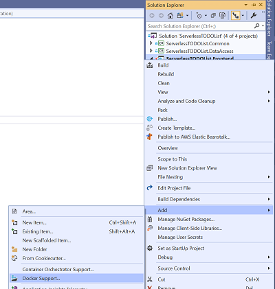
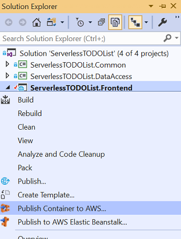
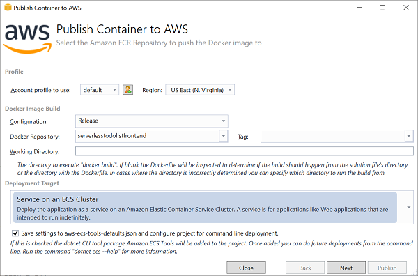
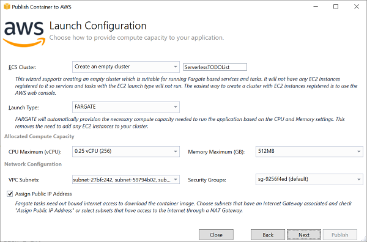
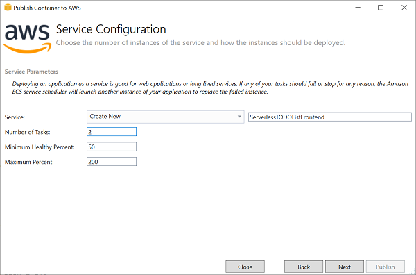
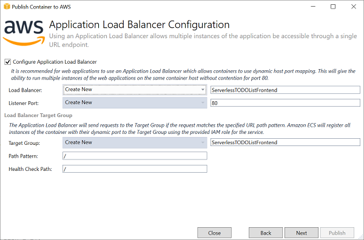
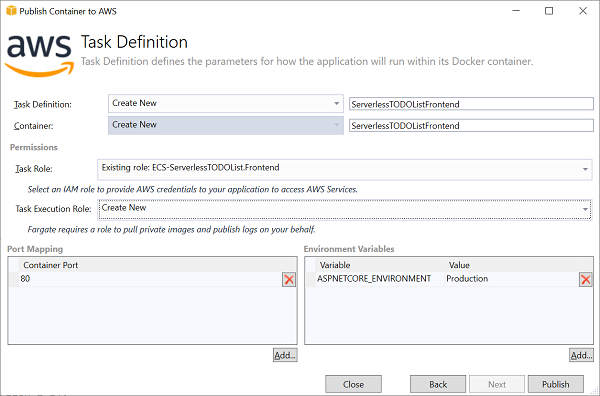
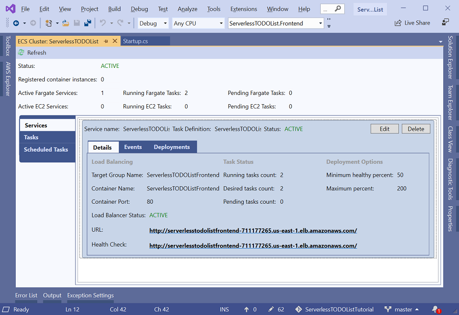

# Deploying to Fargate


## AWS Identity and Access Management (IAM) Role

When the application is deployed to Fargate an IAM role is required. The role provides AWS credentials to the container
that can be used to access other AWS services. When you construct a service client from the 
AWS SDK for .NET without specifying credentials the SDK will locate the credentials for the assigned role.

Our application needs access to DynamoDB, Systems Manager and Cognito. Fargate will log messages written to standard out 
and standard error to CloudWatch Logs so make sure the IAM role we use during deployment has access to 
CloudWatch Logs.

If you don't have an IAM role that has the required permissions then skip down to the [Create Role](#create-role)
section at the bottom of this page to create an IAM role and then return back here.


## Adding Dockerfile


To deploy to Fargate, Docker must be installed and running on our machine. The next step is the **ServerlessTODOList.Frontend**
project needs to have a **Dockerfile** in it to tell Docker how to build ServerlessTODOList.Frontend as a Docker image.

In Visual Studio a quick way to create a Dockerfile is to right click on the ServerlessTODOList.Frontend project and
select **Add -> Docker Support**.



That will create a Dockerfile in the project with content below.

```
FROM mcr.microsoft.com/dotnet/core/aspnet:2.1-stretch-slim AS base
WORKDIR /app
EXPOSE 80
EXPOSE 443

FROM mcr.microsoft.com/dotnet/core/sdk:2.1-stretch AS build
WORKDIR /src
COPY ["ServerlessTODOList.Frontend/ServerlessTODOList.Frontend.csproj", "ServerlessTODOList.Frontend/"]
COPY ["ServerlessTODOList.Common/ServerlessTODOList.Common.csproj", "ServerlessTODOList.Common/"]
COPY ["ServerlessTODOList.DataAccess/ServerlessTODOList.DataAccess.csproj", "ServerlessTODOList.DataAccess/"]
RUN dotnet restore "ServerlessTODOList.Frontend/ServerlessTODOList.Frontend.csproj"
COPY . .
WORKDIR "/src/ServerlessTODOList.Frontend"
RUN dotnet build "ServerlessTODOList.Frontend.csproj" -c Release -o /app

FROM build AS publish
RUN dotnet publish "ServerlessTODOList.Frontend.csproj" -c Release -o /app

FROM base AS final
WORKDIR /app
COPY --from=publish /app .
ENTRYPOINT ["dotnet", "ServerlessTODOList.Frontend.dll"]
```

## Deployment Wizard

Now that the project file has a Dockerfile, when we right click on the ServerlessTODOList.Frontend project we will
see a new menu item to **Publish Container to AWS...**.



### Wizard page 1 - Set deployment type



In the first page of the wizard you will configure the Docker repository in the Amazon Elastic Container Registry (ECR) where
the docker image that is about to be created will be pushed.

Also on this page we will choose how we want to deploy the container via the **Deployment Target** drop down box. The options
are:

| Name | Description |
| --- | --- |
| Service on an ECS Cluster | For projects like our web application where the process should run indefinitely. |
| Run Task on an ECS Cluster | For projects like batch processing that do a define amount of work and exit when the work is done. |
| Schedule Task on an ECS Cluster | This is the same as the run task option but but allows the task to be run on a schedule. |
| Push only the Docker image to Amazon Elastic Container Registry | Only push the project to ECR. Then use other tooling to run the new container image in ECS |

For our tutorial we can leave everything at the default which will push the new container image to the **serverlesstodolistfrontend**
repository in ECR and choose to run the image as a service.


### Wizard page 2 - Fargate configuration



Here the ECS cluster that will run the project must be picked. For the tutorial select **Create an empty cluster** and set the 
name to **ServerlessTODOList**. The term "empty" refers to the fact that no EC2 instances will be added to the cluster. 
In our case we are going to use Fargate instead of EC2 to provide the compute power to run our application. In the <a href= "https://console.aws.amazon.com/ecs" target="_blank">ECS web console</a> you can create ECS clusters with EC2 instances if you prefer to configure your EC2 instances and have complete access to them vs Fargate.

The rest of the settings in the wizard configure how much compute power Fargate should provide to the container
and the VPC and Security Group the Fargate compute environment will launch in. By default these fields will be set to
the minimum compute power and the default VPC and security group.

As long as you have a default VPC in your account you can leave everything at the default on this page except ECS Cluster being set to 
**Create an empty cluster** and the name set to **ServerlessTODOList**.

### Wizard page 3 - ECS service configuration



Here we we are going to select **Create new** for the Service and set the name to **ServerlessTODOListFrontend**.

To ensure we have some redundancy lets set the **Number of Tasks** to 2.

**Minimum Healthy Percent** and **Maximum Percent** can be left at the defaults. These fields are used when publishing
new versions of the project. By setting Minimum Healthy Percent to 50 percent ensures ECS won't remove both of our 
existing tasks until at least one new task using the new container image has launched. By having Maximum Percent
set to 200 allows ECS to add 2 new tasks running the project before shutting down the old ones getting the total count of task
temporary up to 4. Once the 2 new tasks are running ECS will shutdown the older 2 tasks.

### Wizard page 4 - Application Load Balancer configuration



Since we have a web application that is going to be supported by multiple Fargate tasks and we need a constant
HTTP endpoint we will enable **Configure Application Load Balancer**. 

Configuring an Application Load Balancer is done in 2 parts. First is selecting the Load Balancer and listener port we 
want to use. Lets create a new load balancer named **ServerlessTODOListFrontend** with a listener port of **80**.

The **Target Group** is a grouping of compute power. It is where the ECS service will register the tasks to create for the service. The 
Application Load Balancer will choose which Target Group to send the request to based on the **Path Pattern**.
In our case we will create a new Target Group with a name of **ServerlessTODOListFrontend** and a **Path Pattern** of `/`.
This means all request to the Application Load Balancer will go to this target. In the future if we have another
administration application that we want to access through the `/admin` path we can deploy using the same 
Application Load Balancer but create a new Target Group with a Path Pattern of `/admin`.

Note: If you want a HTTPS endpoint use the [Elastic Load Balancer web console](https://console.aws.amazon.com/ec2/home?#LoadBalancers:sort=loadBalancerName)
to create a the load balancer and listener. When you create the listener in the console you can configure HTTPS and the
certificate used. Once the load balancer and listener are created you can select them in the Visual Studio publishing wizard.

### Wizard page 5 - Task Definition configuration



ECS deploys docker images through a Task Definition. The Task definition allows multiple docker images to deployed together as 
a unit similar to a docker compose file. The Task Definition allows you to configure many settings for the containers such as
logging, environment variables, ports and networking. The Visual Studio publishing supports a minimum set of configurations
for taking a application from Visual Studio and deploying to ECS. For more advanced settings I recommend setting up the task definition in the 
[ECS web console](https://console.aws.amazon.com/ecs/home?#/taskDefinitions) and then selecting the task definition in
the Visual Studio publishing wizard.

Values to set on this page:

| <div style="width:200px">Name</div> | Description |
| ------| --- |
| Task Definition | Set to Create New with a name of **ServerlessTODOListFrontend** |
| Container | Set to Create New with a name of ServerlessTODOListFrontend |
| Task Role | Select the IAM role that the application will assume. This is likely the IAM role created at the start of this page. |
| Task Execution Role | Set to Create New or ecsTaskExecutionRole if you have one. This is the role the ECS service will assume to manage your tasks, like registering with the Target Group. |
| Port Mapping | With Fargate there is no a mapping between container port and host port. Here you list the ports to expose. |
| Environment Variables | Environment variables to set before the container is run. For convenience the Visual Studio publishing wizard presets ASPNETCORE_ENVIRONMENT to production for ASP.NET Core projects. |

When all of the fields are set push the **Publish** button to start deploying our application.

## ECS Cluster View

Once the publishing button is pushed the wizard will launch doing the following steps:

* Run a docker build command
* Log on to ECR
* Push the just build docker image to ECR
* Create the Application Load Balancer
* Create the ECS cluster
* Create the ECS service within the cluster

Once it has done all of those steps it will display the ECS cluster view from the AWS Explorer. This will show the load balancer
being provisioned and 2 tasks in pending status. In about a minute the 2 tasks will be in running state and 
the load balancer will be active. Once it is active you can click on the link to view our deployed Serverless TODO List
application using Fargate.



## Tear Down

**Important,** unlike a Lambda deployment, where the charges are based on actual invocations of the Lambda function, the cost
for Fargate and Application Load Balancer is based on the length they have been provisioned. To avoid getting unexpected
charges be sure to delete the application when you are done testing. In the ECS Cluster view click the **Delete** button
for the **ServerlessTODOListFrontend** service. The Visual Studio tooling will also delete the associated
Application Load Balancer when the last service using the load balancer is deleted.

## Create Role

This code can be used to create an IAM Role with the appropriate permissions required for 
the ServerlessTODOList.Frontend running in Fargate. If you already have a role then this
section is not necessary. If you do run this code it will create an IAM role called **ECS-ServerlessTODOList.Frontend**
that can be selected for the IAM role during the Fargate deployment.

```cs --source-file ../Snippets/IAMRoleSetups.cs --project ../Snippets/Snippets.csproj --region setup_ecs_frontend_role
```

<!-- Generated Navigation -->
---

* [Getting Started](../GettingStarted.md)
* [What is a serverless application?](../WhatIsServerless.md)
* [Common AWS Serverless Services](../CommonServerlessServices.md)
* [What are we going to build in this tutorial?](../WhatAreWeBuilding.md)
* [TODO List AWS Services Used](../TODOListServices.md)
* [Using DynamoDB to store TODO Lists](../DynamoDBModule/WhatIsDynamoDB.md)
* [Handling service events with Lambda](../StreamProcessing/ServiceEvents.md)
* [Getting ASP.NET Core ready for Serverless](../ASP.NETCoreFrontend/TheFrontend.md)
* [Deploying ASP.NET Core as a Serverless Application](../DeployingFrontend/DeployingFrontend.md)
  * [ASP.NET Core as a Lambda Function?](../DeployingFrontend/AspNetCoreAsLambda.md)
  * [Preparing for Lambda Deployment](../DeployingFrontend/LambdaPrepare.md)
  * [Deploy to Lambda using CloudFormation](../DeployingFrontend/LambdaDeploy.md)
  * [What is for Fargate](../DeployingFrontend/WhatIsFargate.md)
  * **Deploying to Fargate**
* [Tear Down](../TearDown.md)
* [Final Wrap Up](../FinalWrapup.md)

Continue on to next page: [Tear Down](../TearDown.md)

