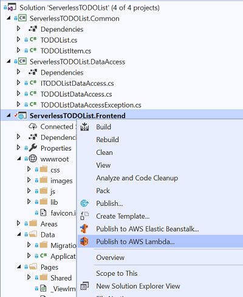

# Preparing for Lambda Deployment

To get our ASP.NET Core project ready for Lambda there are a couple additions we need to make to the project. None of these additions affect
how the project runs locally so you can continue to run and debug locally.

## Add the Amazon.Lambda.AspNetCoreServer package

The first thing we need to do is add the Amazon.Lambda.AspNetCoreServer NuGet package to our ServerlessTODOList.Frontend project.

```
dotnet add package Amazon.Lambda.AspNetCoreServer
```

## Add a Lambda entry point

When we run our application locally the **Program.s** contains the `Main` method which builds and runs the **IWebHost**. This serves as the
entry point when running locally. For Lambda we need a different entry point that will enable API Gateway as the server instead of Kestrel.

Create a class in the project called `LambdaEntryPoint` and add the following code to the project.
```csharp
using Microsoft.AspNetCore.Hosting;
using Microsoft.Extensions.Configuration;

namespace ServerlessTODOList.Frontend
{
    public class LambdaEntryPoint : 
                    Amazon.Lambda.AspNetCoreServer.APIGatewayProxyFunction
    {
        protected override void Init(IWebHostBuilder builder)
        {
            builder
                .ConfigureAppConfiguration(configBuilder =>
                {
                    configBuilder.AddSystemsManager("/ServerlessTODOList/");
                })
                .UseStartup<Startup>();
        }
    }
}
```

Notice how this code is similar to the `CreateWebHostBuilder` method from **Program.cs** including registering Parameter Store
as a configuration provider. The base class **APIGatewayProxyFunction** took care of replacing Kestrel with API Gateway. The base class
also contains the method `FunctionHandlerAsync` which will be the Lambda function handler that Lambda will call
when it gets an event from API Gateway.

## CloudFormation Template

Back when we deployed our Lambda function for DynamoDB stream processing we deployed our code straight to Lambda and then later setup
our event mapping to the DynamoDB stream.

Another option for deploying a serverless application is using CloudFormation. This will allow us to define our API Gateway REST API, Lambda function
IAM Roles and any other resources we might need and create all the AWS resources as one unit called a CloudFormation Stack. It also allows us to
delete all of the resources together when we delete our CloudFormation stack.

In our project add a file called `serverless.template` and add the following JSON.
```json
{
   "AWSTemplateFormatVersion":"2010-09-09",
   "Transform":"AWS::Serverless-2016-10-31",
   "Description":"Template to deploy ASP.NET Core application for the Serverless TODO List application",
   "Parameters":{

   },
   "Conditions":{

   },
   "Resources":{
      "AspNetCoreFunction":{
         "Type":"AWS::Serverless::Function",
         "Properties":{
            "Handler":"ServerlessTODOList.Frontend::ServerlessTODOList.Frontend.LambdaEntryPoint::FunctionHandlerAsync",
            "Runtime":"dotnetcore2.1",
            "CodeUri":"",
            "MemorySize":512,
            "Timeout":30,
            "Role":null,
            "Policies":[
               "arn:aws:iam::aws:policy/service-role/AWSLambdaBasicExecutionRole",
               "arn:aws:iam::aws:policy/AmazonDynamoDBFullAccess",
               "arn:aws:iam::aws:policy/AmazonSSMFullAccess"
            ],
            "Environment":{
               "Variables":{

               }
            },
            "Events":{
               "ProxyResource":{
                  "Type":"Api",
                  "Properties":{
                     "Path":"/{proxy+}",
                     "Method":"ANY"
                  }
               },
               "RootResource":{
                  "Type":"Api",
                  "Properties":{
                     "Path":"/",
                     "Method":"ANY"
                  }
               }
            }
         }
      }
   },
   "Outputs":{
      "ApiURL":{
         "Description":"API endpoint URL for Prod environment",
         "Value":{
            "Fn::Sub":"https://${ServerlessRestApi}.execute-api.${AWS::Region}.amazonaws.com/Prod/"
         }
      }
   }
}
```

Notice how the **Handler** property is pointing to our `LambdaEntryPoint` class and the `FunctionHandlerAsync` method from the base class. 
Also we have defined the Identity and Access Management (IAM) policies we need to get access to DynamoDB and Systems Manager's Parameter Store.
These policies are fairly broad, we could create custom policies to reduce the applications permissions but that is out of the scope of this tutorial.

The API Gateway REST API is configured by the events section. In the ASP.NET Core case we don't want to use API Gateway to handle routing we
want to leave that up to ASP.NET Core. So we have added 2 entries in the events section to cover both the root path `/` and a wild card `/{proxy+}`
for all other requests.

## Updating the Project Type

The last thing we need to do to turn on the Lambda deployment features in Visual Studio is edit the project file for ServerlessTODOList.Frontend and
add the property `AWSProjectType` with a value of Lambda to a `PropertyGroup`. Below is an example.

```xml
<Project Sdk="Microsoft.NET.Sdk.Web">

  <PropertyGroup>
    <TargetFramework>netcoreapp2.1</TargetFramework>
    <UserSecretsId>aspnet-ServerlessTODOList.Frontend-A9210003-C0BD-41B7-BE19-A4F5B45C1A97</UserSecretsId>
    <AWSProjectType>Lambda</AWSProjectType>
  </PropertyGroup>

  <ItemGroup>
    <PackageReference Include="Amazon.AspNetCore.DataProtection.SSM" Version="1.1.0" />
    <PackageReference Include="Amazon.AspNetCore.Identity.Cognito" Version="1.0.2" />
    <PackageReference Include="Amazon.Extensions.Configuration.SystemsManager" Version="1.2.0" />
    <PackageReference Include="Amazon.Lambda.AspNetCoreServer" Version="3.1.0" />
    <PackageReference Include="AWSSDK.DynamoDBv2" Version="3.3.101.20" />
    <PackageReference Include="AWSSDK.Extensions.NETCore.Setup" Version="3.3.100.1" />
    <PackageReference Include="Microsoft.AspNetCore.App" />
    <PackageReference Include="Microsoft.AspNetCore.Razor.Design" Version="2.1.2" PrivateAssets="All" />
    <PackageReference Include="Microsoft.VisualStudio.Web.CodeGeneration.Design" Version="2.1.9" />
  </ItemGroup>

  <ItemGroup>
    <ProjectReference Include="..\ServerlessTODOList.Common\ServerlessTODOList.Common.csproj" />
    <ProjectReference Include="..\ServerlessTODOList.DataAccess\ServerlessTODOList.DataAccess.csproj" />
  </ItemGroup>

</Project>
```

Now when you right click on the project in Visual Studio you can see it is ready to be deployed to Lambda.



<!-- Generated Navigation -->
---

* [Getting Started](../GettingStarted.md)
* [What is a serverless application?](../WhatIsServerless.md)
* [Common AWS Serverless Services](../CommonServerlessServices.md)
* [What are we going to build in this tutorial](../WhatAreWeBuilding.md)
* [TODO List AWS Services Used](../TODOListServices.md)
* [Using DynamoDB to store TODO Lists](../DynamoDBModule/WhatIsDynamoDB.md)
* [Handling service events with Lambda](../StreamProcessing/ServiceEvents.md)
* [Getting ASP.NET Core ready for Serverless](../ASP.NETCoreFrontend/TheFrontend.md)
* [Deploying ASP.NET Core as a Serverless Application](../DeployingFrontend/DeployingFrontend.md)
  * [ASP.NET Core as a Lambda Function?](../DeployingFrontend/AspNetCoreAsLambda.md)
  * **Preparing for Lambda Deployment**
  * [Deploy to Lambda using CloudFormation](../DeployingFrontend/LambdaDeploy.md)
  * [Preparing for Fargate (Container) Deployment](../DeployingFrontend/FargatePrepare.md)
  * [Deploying to Fargate](../DeployingFrontend/FargateDeploy.md)
* [Final Wrap Up](../FinalWrapup.md)

Continue on to next page: [Deploy to Lambda using CloudFormation](../DeployingFrontend/LambdaDeploy.md)

