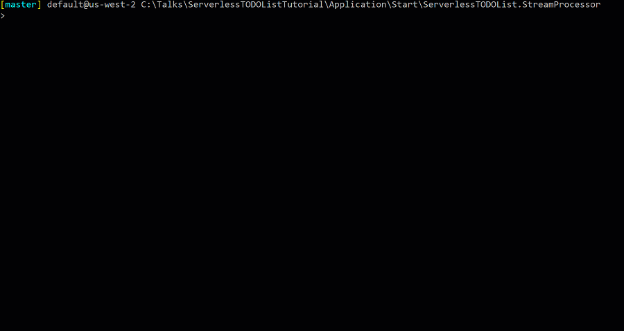

# Deploy Lambda Function

To deploy the Lambda function we can use either the <a href="https://marketplace.visualstudio.com/items?itemName=AmazonWebServices.AWSToolkitforVisualStudio2017" target="_blank">AWS Toolkit for Visual Studio</a> or the <a href="https://github.com/aws/aws-extensions-for-dotnet-cli#aws-lambda-amazonlambdatools" target="_blank">Amazon.Lambda.Tools</a> .NET Core global tool.

## AWS Identity and Access Management (IAM) Role

When this function is deployed an IAM role is required. The role provides AWS credentials to the Lambda function 
that can be used to access other AWS services. When you construct a service client from the 
AWS SDK for .NET without specifying credentials the SDK will locate the credentials for the assigned role.

All roles used for Lambda should have access to **CloudWatch Logs** to support Lambda writing logs. In this Lambda
function we also need access to the **Amazon Simple Email Service** to send emails and read access for the **DynamoDB Stream**.

If you don't have an IAM role that has the required permissions then skip down to the [Create Role](#create-role)
section at the bottom of this page to create an IAM role and then return back here.

## Visual Studio


In the solution explorer right click on the **ServerlessTODOList.StreamProcessor** project and select 
**Publish to AWS Lambda**. This will launch the deployment wizard.

### Wizard Page 1


In the first page we need to specify the name of the Lambda function and identify what .NET method to call. 
To identify the .NET method we have to set the Assembly, Type and Method name. To Lambda this will
get translated to the **Handler** field with a value of &lt;assembly-name>::&lt;type-name>::&lt;method-name>.

#### Profile and Region
Be sure the profile and region are set to the profile and region that was set at the beginning of the tutorial and is where
the DynamoDB table was created.

#### Persist Settings
Note the bottom checkbox to **"Save settings to aws-lambda-tools-defaults.json for future deployments"**.
With this value checked all of the settings made in the wizard will be persisted into the aws-lambda-tools-defaults.json
file. This makes it so redeployments can reuse all of the previous settings as well as make it easy to switch to
the **Amazon.Lambda.Tools** .NET Core global tool.


### Wizard Page 2


#### IAM Role (Required)
The IAM role that you want to use to provide AWS credentials to the Lambda function. If you created the IAM role from the **Create Role** 
section on this page then select the **ServerlessTODOList.StreamProcessor** role.

#### Environment (Required for Tutorial)
Configuration values can be set as environment variables for the Lambda function. For our Lambda function the **FROM_EMAIL** variable must be set
to the address that the email will be sent from.

#### Memory
This controls how much memory will be allocated to Lambda the function while it is processing an event. The amount of memory you allocate also controls
how much CPU power the Lambda function will get. If a Lambda function is not processing fast enough for your requirements try increasing the
memory settings for the function.

#### Timeout
How much time a Lambda function will have to process an event before Lambda will cancel the process.

#### VPC Subnets and Security Groups
If a function needs to access resources that are inside a VPC, like an RDS database, then select subnets and security groups for the VPC to allow
the Lambda function to access the resources. Existing network interfaces in your VPC are mapped to a Hyperplane Elastic Network Interface (ENI) and the functions connect using it. Additional IAM
permissions are required for the IAM role to create the ENI. Check out the Lambda <a href="https://docs.aws.amazon.com/lambda/latest/dg/vpc.html" target="_blank">developer guide</a> for more info.

#### DLQ Resource
Dead Letter Queue (DLQ) can be either an SQS queue or SNS Topic. When a Lambda function throws an unhandled exception while processing an event Lambda will retry the event a few times. If the function still fails Lambda will send the event to the DLQ if one is assigned. This can be useful for troubleshooting and debugging failed events.


### Push Upload

Once you push upload under the covers the tooling will execute the `dotnet publish` command to build
the project then create zip file of the .NET assemblies and all of its required dependencies. The
zip file is uploaded to Lambda and the function is created.

## Amazon.Lambda.Tools .NET Core Global Tool

If you don't have Visual Studio or you want to automate the deployment the **Amazon.Lambda.Tools** .NET Core Global Tool can be used.

To ensure you have installed Amazon.Lambda.Tools execute the following command.

```
dotnet tool install -g Amazon.Lambda.Tools
```

The **aws-lambda-tools-defaults.json** will already have defaults for most all of the values required
to create the Lambda function. The only values that need to set are the Lambda function name and IAM Role.

To deploy the function execute the command from the directory of **ServerlessTODOList.StreamProcessor** execute the following command.

```
dotnet lambda deploy-function ServerlessTODOListStreamProcessor --environment-variable FROM_EMAIL=<from email address> --function-role <iam-role-name> --profile <profile-name> --region <region-name>
```

**Notice** the FROM_EMAIL environment variable is set with the `--environment-variable` switch. The format of this switch is 
`<env-name1>=<env-value1>;<env-name2>=<env-name2>`.

If you also add `--persist-config-file true` to the command then all of the settings set during deployment will be saved in the 
**aws-lambda-tools-defaults.json** file. That way future invocations can be done by just using the command `dotnet lambda deploy-function`.

For any missing required arguments like `--function-role` the command line tool will prompt for the missing 
required parameters.




## Create Role

This code can be used to create an IAM Role with the appropriate permissions required for 
the ServerlessTODOList.StreamProcessor Lambda function. If you already have a role then this
section is not necessary.

```cs --source-file ../Snippets/IAMRoleSetups.cs --project ../Snippets/Snippets.csproj --region setup_streamprocessor_role
```

<!-- Generated Navigation -->
---

* [Getting Started](../GettingStarted.md)
* [What is a serverless application?](../WhatIsServerless.md)
* [Common AWS Serverless Services](../CommonServerlessServices.md)
* [What are we going to build in this tutorial](../WhatAreWeBuilding.md)
* [TODO List AWS Services Used](../TODOListServices.md)
* [Using DynamoDB to store TODO Lists](../DynamoDBModule/WhatIsDynamoDB.md)
* [Handling service events with Lambda](../StreamProcessing/ServiceEvents.md)
  * [TODO List Task Assignments](../StreamProcessing/TODOTaskListAssignment.md)
  * [Enable DynamoDB Stream](../StreamProcessing/EnableDynamoDBStream.md)
  * [Assign Task Lambda Function](../StreamProcessing/LookAtLambdaFunction.md)
  * **Deploy Lambda Function**
  * [Setting up Amazon Simple Email Service (SES)](../StreamProcessing/SettingUpSES.md)
  * [Configuring DynamoDB as an event source](../StreamProcessing/ConfigureLambdaEventSource.md)
  * [Testing Lambda Function](../StreamProcessing/TestingLambdaFunction.md)
  * [Tips for troubleshooting Lambda functions](../StreamProcessing/TroubleshootingLambda.md)
  * [Stream processing wrap up](../StreamProcessing/StreamProcessingWrapup.md)
* [Getting ASP.NET Core ready for Serverless](../ASP.NETCoreFrontend/TheFrontend.md)
* [Deploying ASP.NET Core as a Serverless Application](../DeployingFrontend/DeployingFrontend.md)
* [Tear Down](../TearDown.md)
* [Final Wrap Up](../FinalWrapup.md)

Continue on to next page: [Setting up Amazon Simple Email Service (SES)](../StreamProcessing/SettingUpSES.md)

