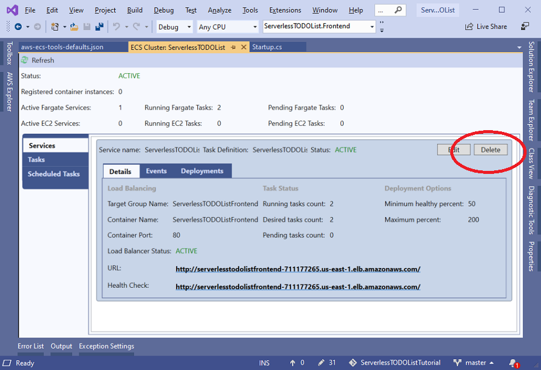

# Tear Down

Before you end this tutorial it is be sure to tear down the AWS resources created during the tutorial. 
This will avoid any unexpected charges for resources left on like the DynamoDB table or Fargate container.

## Tear Down Fargate Container

If you went through the Fargate deployment sections the easiest way to tear down the running containers
and the Application Load Balancer created during the the tutorial is to delete the ECS service in Visual Studio.
To do that open the ECS Cluster view and click the **Delete** button.



```cs --source-file ./Snippets/TearDown.cs --project ./Snippets/Snippets.csproj --region resources_to_tear_down
```

## Other resource tear down

For the other resources if you used the names suggest in the tutorial then running this code box will delete the
resources. If you changed the names then update the properties in the code box and then execute to delete
the resources.


<!-- Generated Navigation -->
---

* [Getting Started](./GettingStarted.md)
* [What is a serverless application?](./WhatIsServerless.md)
* [Common AWS Serverless Services](./CommonServerlessServices.md)
* [What are we going to build in this tutorial](./WhatAreWeBuilding.md)
* [TODO List AWS Services Used](./TODOListServices.md)
* [Using DynamoDB to store TODO Lists](./DynamoDBModule/WhatIsDynamoDB.md)
* [Handling service events with Lambda](./StreamProcessing/ServiceEvents.md)
* [Getting ASP.NET Core ready for Serverless](./ASP.NETCoreFrontend/TheFrontend.md)
* [Deploying ASP.NET Core as a Serverless Application](./DeployingFrontend/DeployingFrontend.md)
* **Tear Down**
* [Final Wrap Up](./FinalWrapup.md)

Continue on to next page: [Final Wrap Up](./FinalWrapup.md)

