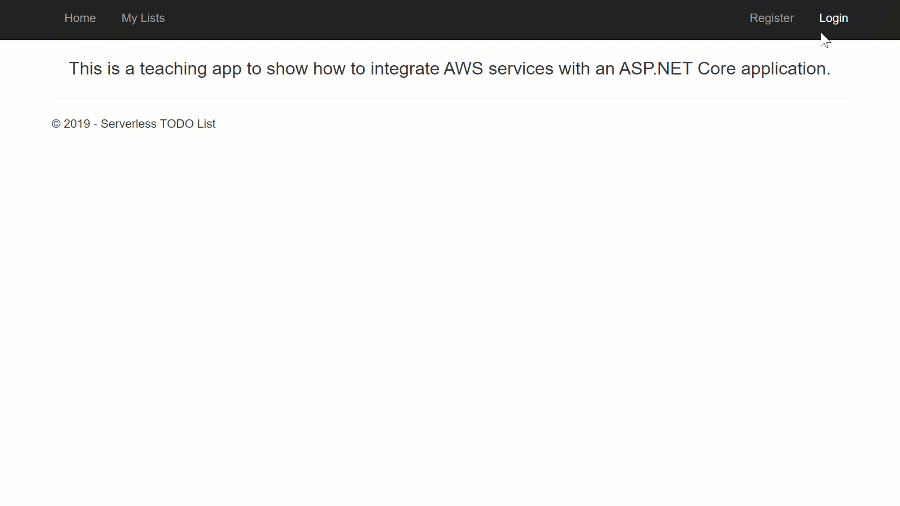

# What are we going to build in this tutorial?

In this tutorial we are going to be building a very simple serverless application to manage TODO lists. It will have the following features:

* Register and authenticate users
* Create, update and delete lists with tasks
* Assign tasks from a list to users

## The Code

The code we will work with for this tutorial is under the **Application** directory in this repository. It is recommended you open the **ServerlessTODOList.sln** solution
under the **Application\Start** directory in your IDE of choice. This tutorial will walk you through adding the missing pieces in the application to produce the version in the **Application\Final**
directory.

## AWS Toolkit for Visual Studio

If you following along with Visual Studio it is recommended you have the <a href="https://marketplace.visualstudio.com/items?itemName=AmazonWebServices.AWSToolkitforVisualStudio2017" target="_blank">AWS Toolkit for Visual Studio</a> installed 
to make it easy to deploy your code. If you are not using Visual Studio, command line instructions will also be provided for most sections.

<!-- Generated Navigation -->
---

* [Getting Started](./GettingStarted.md)
* [What is a serverless application?](./WhatIsServerless.md)
* [Common AWS Serverless Services](./CommonServerlessServices.md)
* **What are we going to build in this tutorial**
* [TODO List AWS Services Used](./TODOListServices.md)
* [Using DynamoDB to store TODO Lists](./DynamoDBModule/WhatIsDynamoDB.md)
* [Handling service events with Lambda](./StreamProcessing/ServiceEvents.md)
* [Getting ASP.NET Core ready for Serverless](./ASP.NETCoreFrontend/TheFrontend.md)
* [Deploying ASP.NET Core as a Serverless Application](./DeployingFrontend/DeployingFrontend.md)
* [Tear Down](./TearDown.md)
* [Final Wrap Up](./FinalWrapup.md)

Continue on to next page: [TODO List AWS Services Used](./TODOListServices.md)

