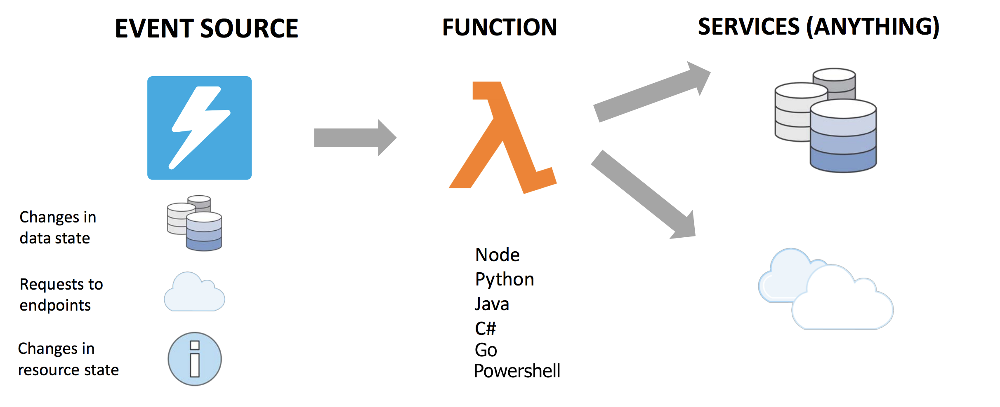

# What is a serverless application?

I like to define serverless in 3 ways: no servers to manage, only pay for what I use, and no need to predict user traffic as it scales automatically.

## No server management

There is no need to provision or maintain any servers. There is no software or runtime to install, maintain, or administer. This is generally why the word serverless makes more sense if you say "serverless to me", it's not that our solution isn't running on servers, it most definitely is. It's more so I am not touching those servers, it's serverless to me.

## Automatic scaling

Lambdas scale automatically without the need to predict user traffic. AWS does all the scaling work for you! With some of the other services we use in conjunction with Lambda to create serverles applications, you can select for auto-scaling or you can scale simply by changing the provisioning settings.

## Pay for what you need

You only pay for the time your lambda was executing. This means you truly only pay for what you used and nothing more which can be different from a server running all the time or a virtual instance doing the same thing. Fun fact about lambda is also that you get 1M invocations of a function for free every month indefinitely.

## Automated high availability

Serverless provides built-in availability and fault tolerance. You don't need to architect for these capabilities since the services running the application provide them by default.

## Basic overview of a serverless app

<!-- Generated Navigation -->
---

* [Getting Started](./GettingStarted.md)
* **What is a serverless application?**
* [Common AWS Serverless Services](./CommonServerlessServices.md)
* [What are we going to build in this tutorial](./WhatAreWeBuilding.md)
* [TODO List AWS Services Used](./TODOListServices.md)
* [Using DynamoDB to store TODO Lists](./DynamoDBModule/WhatIsDynamoDB.md)
* [Handling service events with Lambda](./StreamProcessing/ServiceEvents.md)
* [Getting ASP.NET Core ready for Serverless](./ASP.NETCoreFrontend/TheFrontend.md)
* [Deploying ASP.NET Core as a Serverless Application](./DeployingFrontend/DeployingFrontend.md)
* [Tear Down](./TearDown.md)
* [Final Wrap Up](./FinalWrapup.md)

Continue on to next page: [Common AWS Serverless Services](./CommonServerlessServices.md)

