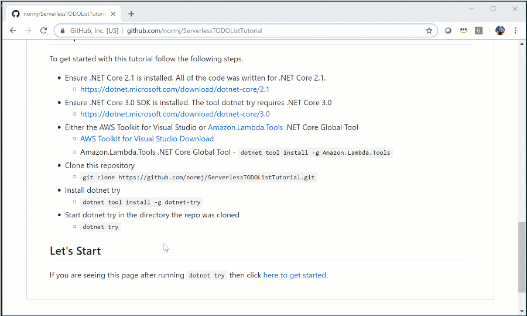

# Building a AWS Serverless TODO List Application

This tutorial shows how to build a very simple TODO list application. Along the way you will learn how to use several AWS services like Amazon DynamoDB and AWS Lambda.
I wrote this with the intention of using this as material for giving AWS Talks on .NET serverless but it should be easy enough to follow by yourself. 
If not please let me know where I can clarify things.

## dotnet try

At Microsoft's 2019 Build conference a new .NET Global tool called <a href="https://github.com/dotnet/try" target="_blank">dotnet try</a> was released which allows the creation of interactive .NET documentation. 

## Setup

To get started with this tutorial follow the following steps.

* Ensure .NET Core 3.1 SDK is installed. The tool dotnet try requires .NET Core 3.1
  * https://dotnet.microsoft.com/download/dotnet-core/3.1
* Either the AWS Toolkit for Visual Studio or <a href="https://github.com/aws/aws-extensions-for-dotnet-cli#aws-lambda-amazonlambdatools" target="_blank">Amazon.Lambda.Tools</a> .NET Core Global Tool
  * <a href="https://marketplace.visualstudio.com/items?itemName=AmazonWebServices.AWSToolkitforVisualStudio2017" target="_blank">AWS Toolkit for Visual Studio Download</a>
  * Amazon.Lambda.Tools .NET Core Global Tool - `dotnet tool install -g Amazon.Lambda.Tools`
  * **Note:** The AWS Toolkit for Visual Studio is not compatible with Visual Studio for Mac.
* Clone this repository. Be sure to clone the repository in a directory you have write access.
  * `git clone https://github.com/normj/ServerlessTODOListTutorial.git`
* Install dotnet try
  * `dotnet tool install -g dotnet-try`
* Start dotnet try in the directory the repo was cloned
  * `dotnet try`

## Let's Start

If you are seeing this page after running `dotnet try` then click [here to get started](./DotnetTryMaterial/GettingStarted.md).  